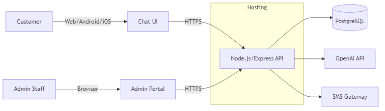
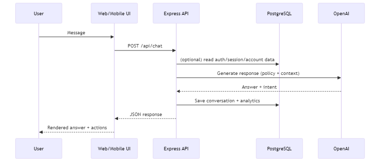
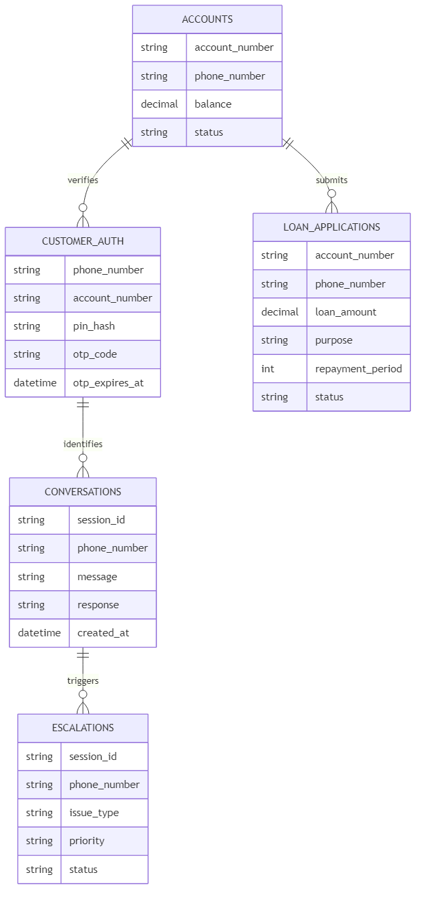

# AKCB AI Chatbot
## 24/7 customer service + secure self-service banking

- Production: https://amankacombank.com
- Stack: Node.js + Express + TypeScript + PostgreSQL + OpenAI

---

# The Problem

- Customers need support outside banking hours
- Call center workload grows with customer growth
- Routine inquiries overload staff (balance, branches, loans, requirements)
- Response times become inconsistent

**Goal:** Reduce routine workload and improve customer experience.

---

# What We Built

A secure, AI-assisted banking support system with:

- Customer authentication (OTP + PIN)
- Balance inquiry (database-backed)
- Loan request / application capture
- Nearest branch finder (GPS + map fallbacks)
- Admin portal (analytics + escalation + conversation viewer)
- Web + Android + iOS (Cordova)

---

# Real Data Snapshot (Project Dataset)

**Accounts dataset (Accounts.csv)**
- Total accounts: **48,871**
- Total balance (GHS): **150,485,333.49**
- Average balance (GHS): **3,079.24**
- Min balance (GHS): **0.00**
- Max balance (GHS): **1,912,113.02**

**Training dataset (bank_chatbot_training_data_all_expanded.csv)**
- Rows (excluding header): **299**

---

# Real Production Availability (Measured)

- Production homepage status: **HTTP 200**
- HEAD response time (measured): **253 ms**

---

# Customer Experience

**Entry points**
- Web chat (desktop/mobile browser)
- Android app (Cordova)
- iOS app (Cordova)

**UX principles**
- Guided buttons / prompts
- Security-first flows
- Clear next steps
- Fallbacks for restricted networks (maps)

---

# Authentication Flow (OTP + PIN)

**First-time user**
- Enter phone + account number
- Receive OTP via SMS
- Verify OTP
- Create 4-digit PIN

**Returning user**
- Enter phone + account number
- Enter PIN

**Security**
- PIN stored as bcrypt hash
- OTP expiration
- Retry limits / lockouts (configurable)

---

# Core Banking Features

1) **Balance Inquiry**
- Reads latest balance from database
- Returns formatted response (GHS)

2) **Loan Application**
- Captures amount, purpose, repayment period
- Saves application for review

3) **Nearest Branch Finder**
- Uses GPS coordinates
- Computes nearest from configured branches
- Outputs address + phone + coordinates + map links

---

# Branch Finder (Configured Branches)

Configured branches: **8**

- Amantin (Head Office)
- Atebubu
- Kajaji
- Kwame Danso
- Yeji
- Ahwiaa
- Ejura
- Kumasi (Kejetia market)

**Navigation outputs**
- Google Maps / OpenStreetMap / Apple Maps / geo:
- Copy/Share GPS coordinates (works even if map sites are blocked)

---

# Admin Portal

**Admin capabilities**
- Conversation analytics (volume, sessions)
- Escalation queue (priority + assignment)
- Conversation viewer (full transcript)
- Bulk updates (balances via CSV)

Supports QA, compliance reviews, and operational oversight.

---

# System Architecture (High Level)

---

# Backend Modules (Actual Repo Files)

- src/index.ts (Express routes)
- src/database.ts (DB connection + queries)
- src/customerAuth.ts + src/otpService.ts (OTP/PIN auth)
- src/balanceUpdater.ts (balance utilities)
- src/loanManager.ts (loan workflows)
- src/analytics.ts (admin analytics)
- src/webCrawler.ts (knowledge ingestion)

---

# Chat Request Flow

- User sends message (Web/Mobile UI)
- UI calls `POST /api/chat`
- API loads session/account context (as needed)
- API calls OpenAI with system policy + context
- API saves conversation + analytics
- UI renders the answer safely (escaped HTML + link handling)

---

# Data Design (Conceptual)

---

# Security Design

- HTTPS/TLS for all traffic
- PIN stored hashed (bcrypt)
- OTP expiration + retry controls
- Parameterized SQL queries
- Safe HTML rendering in chat UI (XSS prevention)
- Admin endpoints protected by authentication
- Secrets in environment variables (OpenAI, DB, SMS)

---

# Performance + Reliability

- Measured production homepage response: **~253 ms** (HEAD)

Design choices:
- Lightweight UI
- Efficient DB lookups
- Simple distance computation for branch finder
- Logging + metrics hooks for diagnostics

---

# Deployment (Render + GitHub)

- GitHub repo triggers Render auto-deploy
- Build: `npm install` → `npm run build`
- Run: `npm start`
- DB: Render PostgreSQL

---

# Current Status & Risk

Confirmed:
- Production homepage reachable and responsive
- Codebase implements API routes (chat, branch, admin)

Risk to validate before a live demo:
- Confirm production API paths return 200 (not 404) end-to-end

---

# Live Demo Plan

1) Greeting + verification (OTP/PIN)
2) Balance inquiry
3) Loan request submission
4) Nearest branch + copy coordinates
5) Admin portal: analytics + conversation viewer

Fallbacks:
- Local demo
- Screenshots / recorded demo

---

# Business Value & ROI (Talk Track)

- 24/7 coverage without 24/7 staffing
- Reduces repeat routine calls
- Faster customer response times
- Admin visibility for QA/compliance

Next steps:
- Pilot rollout
- Monitor metrics (volume, escalations, satisfaction)
- Iterate and expand capabilities

---

# Q&A

Prepared answers:
- Security: OTP + hashed PIN + HTTPS + DB protections
- Accuracy: DB-backed balances + controlled workflows
- Cost: hosting + SMS + OpenAI usage-based
- Continuity: fallbacks for restricted networks (maps)
