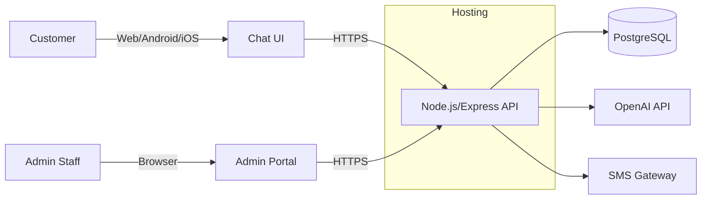
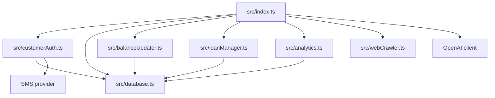
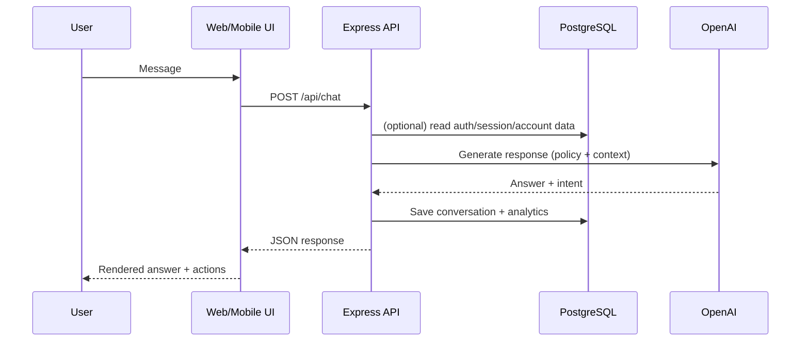
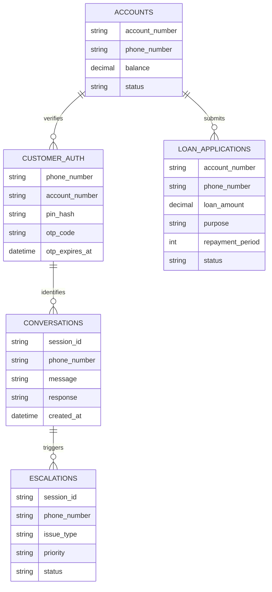
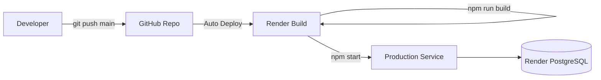

# AKCB AI Chatbot — Project Presentation Deck

**Audience:** Bank management + IT + operations  
**Date:** December 2025  
**Project:** AKCB AI Customer Service Chatbot (Web + Mobile + Admin)

---

## Slide 1 — Title

### AKCB AI Chatbot
**24/7 customer service + secure self-service banking + admin analytics**

- Production: https://amankacombank.com
- Stack: Node.js + Express + TypeScript + PostgreSQL + OpenAI

---

## Slide 2 — The Problem

- Customers need support outside banking hours
- Call center workload scales with customer growth
- Routine inquiries (balances, branches, loan info) overload staff
- Human-only support makes response times inconsistent

**Goal:** Reduce routine workload while improving customer experience.

---

## Slide 3 — What We Built

A secure, AI-assisted banking support system with:

- Customer authentication (OTP + PIN)
- Balance inquiry (database-backed)
- Loan request / application capture
- Nearest branch finder (GPS + multi-map fallback)
- Admin portal (analytics + escalation + conversation viewer)
- Web + Android + iOS (Cordova) support

---

## Slide 4 — Real Data Snapshot (From This Project’s Dataset)

**Accounts dataset (Accounts.csv):**
- Total accounts: **48,871**
- Total balance (GHS): **150,485,333.49**
- Average balance (GHS): **3,079.24**
- Min balance (GHS): **0.00**
- Max balance (GHS): **1,912,113.02**

**Chat training dataset (bank_chatbot_training_data_all_expanded.csv):**
- Rows (excluding header): **299**

---

## Slide 5 — Real Production Availability (Measured)

- Production homepage status: **HTTP 200**
- HEAD response time (measured): **253 ms**

This verifies the public site is reachable and responsive.

---

## Slide 6 — Customer Experience (What Users See)

**Primary entry points:**
- Web chat (desktop/mobile browser)
- Android app (Cordova)
- iOS app (Cordova)

**Experience principles:**
- Simple guided buttons / prompts
- Security first (OTP/PIN)
- Clear next steps
- Fallback options (especially for maps/network restrictions)

---

## Slide 7 — Authentication Flow (OTP + PIN)

**First-time user:**
1. Enter phone + account number
2. Receive OTP by SMS
3. Verify OTP
4. Create 4-digit PIN

**Returning user:**
1. Enter phone + account number
2. Enter PIN

**Security:**
- PIN stored as hash (bcrypt)
- OTP expiration
- Retry limits / lockouts (configurable)

---

## Slide 8 — Core Banking Features

1. **Balance Inquiry**
   - Reads latest balance from database
   - Returns formatted response (GHS)

2. **Loan Application**
   - Captures amount, purpose, period
   - Saves application for review

3. **Nearest Branch Finder**
   - Uses GPS coordinates
   - Computes nearest from configured branches
   - Provides address + phone + coordinates + map links

---

## Slide 9 — Branch Finder (Real Config)

**Configured branches:** **8**

- Amantin (Head Office)
- Atebubu
- Kajaji
- Kwame Danso
- Yeji
- Ahwiaa
- Ejura
- Kumasi (Kejetia market)

**Navigation outputs:**
- Google Maps link
- OpenStreetMap link
- Apple Maps link
- Mobile geo: link
- Copy/Share GPS coordinates (works even if map sites are blocked)

---

## Slide 10 — Admin Portal Features

**Admin dashboard capabilities:**
- Conversation analytics (volume, sessions)
- Escalation queue (priority + assignment)
- Conversation viewer (full session transcript)
- Operational tools (e.g., bulk balance updates via CSV)

This supports QA, compliance reviews, and operational oversight.

---

## Slide 11 — System Architecture (High Level)

---

## Slide 12 — Backend Module Design

---

## Slide 13 — Request/Response Flow (Chat)

---

## Slide 14 — Data Design (Conceptual ER)

---

## Slide 15 — Security Design

- HTTPS/TLS for all client-to-server traffic
- PINs hashed (bcrypt) — never stored in plain text
- OTP expiration + retry limits
- Parameterized SQL queries (prevents SQL injection)
- Output HTML escaping in chat renderer (prevents XSS)
- Admin endpoints protected behind authentication
- Environment variables store secrets (OpenAI keys, DB URL)

---

## Slide 16 — Performance + Reliability

**Measured in this environment (production HEAD request):**
- **253 ms** response time

Design choices:
- Lightweight web UI
- Efficient DB lookups for balance/auth
- Simple distance computation (Haversine) for branch finder
- Logging + metrics hooks for diagnostics

---

## Slide 17 — Deployment & CI/CD (Render + GitHub)

---

## Slide 18 — Current Status & Risk

What we can confirm right now:
- Production homepage is reachable and fast
- Codebase contains API routes for:
  - /api/chat
  - /api/nearest-branch
  - /api/admin/*

Operational risk to verify before presenting live:
- Production API endpoints must be validated end-to-end (chat, auth, balance, admin).

---

## Slide 19 — Demo Plan (Live)

1. Greeting + verification (OTP/PIN)
2. Balance inquiry
3. Loan request submission
4. Nearest branch + copy coordinates
5. Admin portal: analytics + conversation viewer

Fallback if internet/services fail:
- Use screenshots / recorded demo video
- Use local environment demo

---

## Slide 20 — Business Value & ROI (Talk Track)

- 24/7 coverage without staffing 24/7
- Reduces repeat routine calls (balance, branch, loan info)
- Faster customer response times
- Admin visibility: compliance + QA + operational intelligence

Next steps:
- Pilot rollout (limited cohort)
- Monitor metrics (volume, escalations, satisfaction)
- Iterate and expand capabilities

---

## Slide 21 — Q&A

Prepared answers:
- Security: OTP + hashed PIN + HTTPS + DB protections
- Accuracy: DB-backed balance + controlled workflows
- Cost: hosting + SMS + OpenAI usage-based
- Continuity: fallbacks for maps/network restrictions

---

# Appendix — Source of Real Numbers

- Accounts dataset: `Accounts.csv`
- Training dataset: `bank_chatbot_training_data_all_expanded.csv`
- Production measurement: `Invoke-WebRequest -Method Head https://amankacombank.com`
